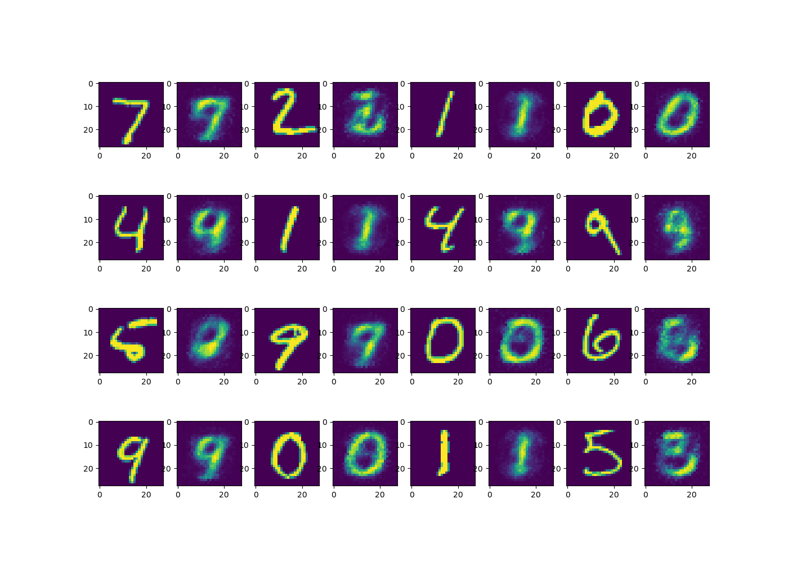

# A Python implementation of a neural network
This framework allow for separate customizable layers that can be stitched together to create a fully connected neural network. 
The necessary weights backpropagation and the forward-pass will be automatically generated in between the created layers.
The implementation allows the user to extract node values from every layer to represent each latent space. 
To allow constructs like GAN (Generative Adversarial Networks) the training cycle can be adjusted to only update certain weights.

The folder results includes examples of generated images from GAN and AE (Auto Encoder) implementations.
The backpropagation function is heavily annotated to server as a learning resource.

